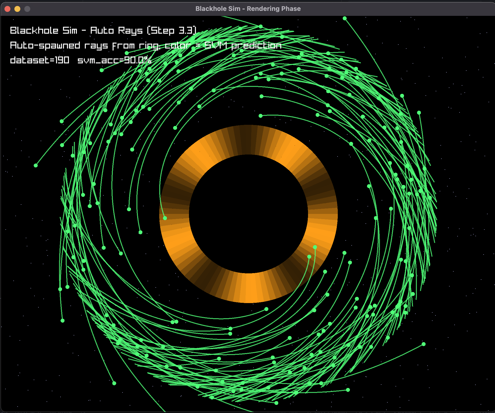

# Blackhole Sim

Interactive 2D ray-tracing inspired simulation of light paths near a Schwarzschild black hole. Rendered with raylib, UI with ImGui (scaffolded), math with Eigen, and online learning with a linear SVM trained on Random Fourier Features (RBF approximation) and calibrated via Platt scaling.



### High-level system

```mermaid
flowchart LR
  A[Spawn initial state\n(p0, v0)] --> B[Physics Integrator\nΔθ bending + step]
  B --> C{Outcome?}
  C -- r < r_ph --> C1[Captured]
  C -- r > R_max --> C2[Escaped]
  C -->|continue| B

  A -. log .-> D1[(Dataset)]
  C1 -. label -1 .-> D1
  C2 -. label +1 .-> D1

  D1 --> E[Scaler (z-score)]
  E --> F[RFF φ(x) ~ RBF]
  F --> G[Linear SVM (hinge)]
  G --> H[Platt scaling\nP(y=1|s)]

  A -. predict .-> E
  E --> F --> G --> H --> I[Color ray\n(green/red)]
```

## Physics

- Position/velocity/acceleration in 2D using Eigen types `Vec2`/`Mat2`.

- Newtonian acceleration with softening:

  \[\mathbf{a}(\mathbf{p}) = -\frac{GM}{(r^2+\epsilon^2)^{3/2}}\,\mathbf{p}\]

  - `G` is a scaled gravitational constant; `M` is black hole mass; `\epsilon` avoids the singularity.

- Small-angle relativistic bending (velocity rotation each frame):

  \[\Delta\theta \approx \frac{4GM\,\Delta t}{c^2\,r^2}\]

  Rotate velocity by the 2×2 rotation matrix with angle `Δθ`.

- Photon sphere and capture condition:

  \[ r_{\text{ph}} = \frac{3GM}{c^2},\quad r < r_{\text{ph}} \Rightarrow \text{captured} \]

- Integrator (per frame for each ray):
  1) Check `r < r_ph` → captured; 2) compute `Δθ` and rotate velocity; 3) renormalize |v|→c; 4) update `p ← p + vΔt`.

## Machine Learning

- Features: `x = [x0, y0, vx0, vy0]` built from the initial state.
- Dataset: Generated online by simulating the spawned rays to an outcome label: `+1` escape, `-1` capture.
- Scaling: z-score standardization fit on the training split.
- Random Fourier Features (RFF): `φ(x) = √(2/D) cos(Wx + b)` with `W ~ N(0, 2γI)`.
- Linear SVM (hinge-like online GD) with class-weighted C: `C_pos`, `C_neg`.
- Calibration: Platt scaling on a validation split to map scores to probabilities.
- Validation: 80/20 train/val split, accuracy reported on val.

## Controls & Visuals

- Auto-spawn: Rays are emitted near the screen edge with mostly tangential directions and mild inward bias to reveal lensing.
- Manual: Click-drag to place initial position and direction; the SVM prediction colors the ray green (escape) or red (capture).
- Black hole: Filled disk; optional photon-sphere hint (disabled by default in visuals).
- Accretion disk: Animated textured ring.
- Background: Static star field with simple lensing distortion `p' = p + k p / ||p||^2`.

## Build & Run

### macOS (Homebrew)
- Install deps:
  ```bash
  brew install cmake raylib eigen
  ```
- Build and run:
  ```bash
  cmake -S . -B build -DCMAKE_BUILD_TYPE=Release
  cmake --build build -j
  ./build/blackhole_sim
  ```

### Ubuntu/Debian
- Install deps:
  ```bash
  sudo apt update
  sudo apt install -y build-essential cmake libraylib-dev libeigen3-dev
  ```
- Build and run:
  ```bash
  cmake -S . -B build -DCMAKE_BUILD_TYPE=Release
  cmake --build build -j
  ./build/blackhole_sim
  ```
  If `libraylib-dev` is unavailable or outdated, build raylib from source per raylib docs.

### Arch Linux
```bash
sudo pacman -S --needed cmake raylib eigen
cmake -S . -B build -DCMAKE_BUILD_TYPE=Release
cmake --build build -j
./build/blackhole_sim
```

### Windows
- Option A: MSYS2 (MinGW64)
  ```bash
  pacman -S --needed mingw-w64-x86_64-gcc mingw-w64-x86_64-cmake \
                  mingw-w64-x86_64-raylib mingw-w64-x86_64-eigen
  cmake -S . -B build -G "MinGW Makefiles" -DCMAKE_BUILD_TYPE=Release
  cmake --build build -j
  .\\build\\blackhole_sim.exe
  ```
- Option B: vcpkg + MSVC
  ```bash
  vcpkg install raylib eigen3
  cmake -S . -B build -DCMAKE_TOOLCHAIN_FILE="C:/path/to/vcpkg.cmake" -DCMAKE_BUILD_TYPE=Release
  cmake --build build --config Release -j
  .\\build\\Release\\blackhole_sim.exe
  ```

## Project layout

- `src/sim/physics/` — gravity, bending, photon sphere, integrator
- `src/ml/` — data collection, scaler, RFF, SVM, Platt scaling, train/val utilities
- `external/imgui-raylib/` — minimal stub target to keep linking clean

## Key parameters (tunable)

- Gravity: `G, M, c, softening ε`, bending scale
- Visual scale: `pixelsPerUnit`, disk inner/outer radii
- Spawner: rays per second, spawn radius, inward/tangential mix, jitter
- ML: RFF `{D, γ}`, class weights `{C_pos, C_neg}`, epochs, learning rate, val split

## Troubleshooting

- Crash on startup (Eigen dot size mismatch): occurs if prediction happens before scaler/RFF/SVM are ready. The app guards these paths; if you still see issues, rebuild (`cmake --build build -j`) and try again.
- Link errors for raylib: ensure your package manager installed shared libs and CMake finds `raylib` (on macOS via Homebrew this is automatic).

## Notes

- This is a pedagogical, stylized sim (Newtonian + small-angle bending) intended for interactivity and ML experimentation, not a full GR geodesic solver.


